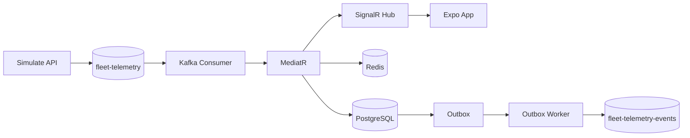
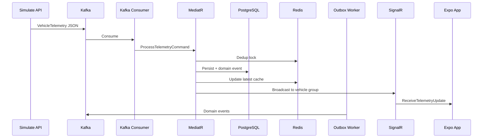

# OmniOps

> Distributed real-time vehicle telemetry platform


OmniOps ingests vehicle GPS telemetry through Apache Kafka, processes it with a .NET 9 backend (CQRS + MediatR), persists history in PostgreSQL, caches hot state in Redis, and streams live updates to an Expo mobile client over SignalR.

The backend uses **Clean Architecture** with four layers, environment-driven configuration, and production-style reliability patterns: transactional outbox, idempotent consumption, and a dead-letter queue.

**Local setup:** [DEV-SETUP.md](DEV-SETUP.md)

---

## How it works





1. The **simulate endpoint** (or any external producer) publishes `VehicleTelemetry` JSON to `fleet-telemetry`.
2. **KafkaTelemetryConsumer** deserializes the message and dispatches `ProcessTelemetryCommand` via MediatR.
3. The handler deduplicates via Redis, persists to PostgreSQL, updates the cache, runs anomaly detection, and broadcasts over SignalR.
4. Domain events are captured by an **EF outbox interceptor** in the same database transaction and later published to `fleet-telemetry-events` by **OutboxPublisherWorker**.

---

## Features

| Area | Implementation |
|------|----------------|
| Event streaming | Kafka consumer with retry, backoff, and DLQ routing |
| CQRS | MediatR commands, queries, logging/validation pipeline behaviours |
| Outbox | `OutboxSaveChangesInterceptor` + polling publisher |
| Idempotency | Redis `SET NX` per packet ID (10-minute TTL) |
| Dead letter queue | Unparseable messages → `fleet-telemetry-dlq` |
| Cache | Redis latest-telemetry per vehicle |
| Anomaly detection | 30-second sliding window (fuel + engine thermal) |
| Playbook orchestration | Simulated RAG incident response via SignalR |
| Real-time | SignalR vehicle groups, camelCase JSON |
| Observability | OpenTelemetry tracing (API, Kafka, SignalR) |
| Mobile | Expo map with live marker updates |

---

## API

| Method | Route | Description |
|--------|-------|-------------|
| `GET` | `/api/telemetry/{vehicleId}` | Latest cached telemetry (Redis) |
| `POST` | `/api/test/simulate/{vehicleId}?packets=N` | Publish mock telemetry to Kafka (`N` = 1–100) |
| `GET` | `/health/live` | Liveness probe (process up) |
| `GET` | `/health/ready` | Readiness probe (Postgres, Redis, Kafka) |
| WS | `/api/stream/telemetry` | SignalR hub |

**SignalR hub**

| Direction | Method / event | Purpose |
|-----------|----------------|---------|
| Client → server | `WatchVehicle(vehicleId)` | Join vehicle broadcast group |
| Client → server | `UnwatchVehicle(vehicleId)` | Leave vehicle group |
| Server → client | `ReceiveTelemetryUpdate` | Live telemetry payload |
| Server → client | `ReceivePlaybookInstructions` | Anomaly playbook response |

Default tracked vehicle in the mobile app: `Truck-001`.

---

## Stack

| Layer | Technology |
|-------|------------|
| API | ASP.NET Core 9 Minimal APIs |
| Application | MediatR (CQRS) |
| Domain | `OmniOps.Core` |
| Infrastructure | EF Core, Kafka, Redis, SignalR |
| Messaging | Apache Kafka (KRaft) |
| Database | PostgreSQL 16 |
| Cache | Redis 7 |
| Mobile | React Native + Expo 54 |
| Containers | Docker Compose |

---

## Repository layout

```text
OmniOps/
├── backend/
│   ├── OmniOps.Api/              Endpoints, middleware, host
│   ├── OmniOps.Application/      Handlers, DTOs, behaviours
│   ├── OmniOps.Core/             Entities, interfaces, events
│   ├── OmniOps.Infrastructure/   Data, Kafka workers, Redis, hubs
│   └── OmniOps.sln
├── omniops-frontend/             Expo mobile app
├── infra/docker-compose.yml      Postgres, Redis, Kafka
├── .env.example                  Backend environment template
└── DEV-SETUP.md                  Setup guide
```

**Dependency flow**

```text
OmniOps.Api
 ├── OmniOps.Application → OmniOps.Core
 └── OmniOps.Infrastructure → OmniOps.Application, OmniOps.Core
```

`OmniOps.Core` has no external package dependencies.

---

## Configuration

Copy `.env.example` to `.env` at the **repository root** for the backend and Docker.

| Variable | Description |
|----------|-------------|
| `DB_CONNECTION_STRING` | Npgsql connection string (`Host=…;Port=…;Database=…;Username=…;Password=…`) |
| `REDIS_CONNECTION_STRING` | Redis connection string |
| `KAFKA_BOOTSTRAP_SERVERS` | Kafka broker (`127.0.0.1:9092`) |
| `KAFKA_MAIN_TOPIC` | Ingestion topic (`fleet-telemetry`) |
| `KAFKA_EVENTS_TOPIC` | Outbox events topic (`fleet-telemetry-events`) |
| `KAFKA_DLQ_TOPIC` | Dead-letter topic (`fleet-telemetry-dlq`) |
| `ALLOWED_CORS_ORIGINS` | Comma-separated origins (production) |

For the mobile app, copy `omniops-frontend/.env.example` to `omniops-frontend/.env`:

```text
EXPO_PUBLIC_API_URL=http://localhost:5031
```

Expo does **not** read the root `.env`. On a physical device, use your machine's LAN IP (e.g. `http://192.168.1.173:5031`).

---

## Quick start

**Prerequisites:** Docker Desktop, .NET 9 SDK, Node.js LTS

```powershell
# Environment
copy .env.example .env
copy omniops-frontend\.env.example omniops-frontend\.env

# Infrastructure
docker compose -f infra/docker-compose.yml up -d

# Backend
cd backend
dotnet run --project OmniOps.Api

# Frontend (new terminal)
cd omniops-frontend
npm install
npx expo start

# Generate telemetry
Invoke-RestMethod -Method POST -Uri "http://localhost:5031/api/test/simulate/Truck-001?packets=10"
```

API listens on `http://localhost:5031`. See [DEV-SETUP.md](DEV-SETUP.md) for troubleshooting.

---

## Testing

The backend includes two test projects under `backend/`:

| Project | Type | Focus |
|---------|------|--------|
| `OmniOps.Application.Tests` | Unit (xUnit + NSubstitute) | MediatR handlers — dedup, persistence, anomaly, cache/query |
| `OmniOps.Infrastructure.Tests` | Integration (Testcontainers) | Outbox interceptor, Redis idempotency, payload parser, Kafka wiring |
| `OmniOps.Api.Tests` | Unit (xUnit) | JWT token service, scope authorization handler |

**Prerequisites:** Docker Desktop must be running (Testcontainers starts ephemeral Postgres, Redis, and Kafka).

```powershell
cd backend
dotnet test
```

Parser-only and handler unit tests run without external services. Integration tests require Docker Desktop to be running.

---

## Docker services

| Service | Image | Host port |
|---------|-------|-----------|
| PostgreSQL | `postgres:16-alpine` | `5433` |
| Redis | `redis:7-alpine` | `6379` |
| Kafka | `apache/kafka:latest` | `9092` |

Kafka uses **KRaft** (no Zookeeper).

---

## Security

- Secrets live in `.env` files (gitignored)
- **JWT bearer authentication** — scope-based policies (`vehicle:read`, `vehicle:simulate`); configurable via `JWT_REQUIRE_AUTHENTICATION`
- SignalR hub secured when auth is enabled; token via `accessTokenFactory` or `?access_token=` query string
- Simulate endpoint rate-limited per client IP (default 10 req / 60 s)
- Development-only `POST /api/auth/token` for issuing test tokens
- Development: permissive CORS, HTTP only (no HTTPS redirect), auth disabled by default
- Production: `JWT_REQUIRE_AUTHENTICATION=true`, strong `JWT_SECRET`, strict CORS via `ALLOWED_CORS_ORIGINS`, HTTPS enforced

---

## Roadmap

**Done:** OpenTelemetry, transactional outbox, DLQ, Redis dedup, anomaly detection, simulated playbook orchestration, unit/integration test suite, JWT auth + hub authorization, simulate rate limiting, FluentValidation, Polly Kafka resilience, health checks

**Planned:** Dedicated worker host, Serilog, Prometheus/Grafana, CI/CD, Kubernetes, geofencing, route replay, real LangGraph/Semantic Kernel integration

---

## License

Portfolio project demonstrating event-driven architecture, real-time streaming, and production-grade .NET backend patterns.
