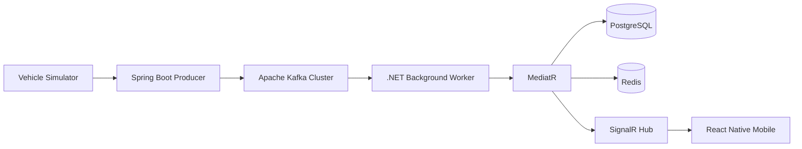
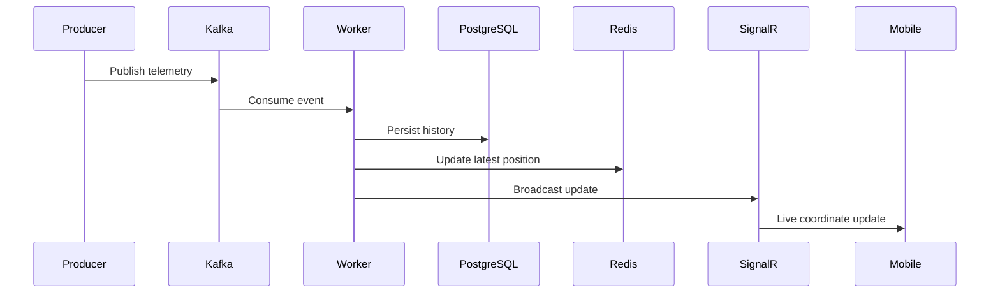

# OmniOps

> **Distributed Real-Time Vehicle Telemetry Tracking Platform**


---

## Overview

OmniOps is a distributed, event-driven telemetry platform that ingests high-frequency vehicle GPS events, processes them asynchronously through Apache Kafka, persists historical data in PostgreSQL, caches the latest vehicle state in Redis, and broadcasts live updates to a React Native client using SignalR.

The project demonstrates production-inspired backend architecture including Clean Architecture, CQRS with MediatR, asynchronous event processing, background workers, distributed caching, and real-time WebSocket communication.

---

# Architecture



## Event Flow



## Core Features

- Real-time vehicle tracking
- Apache Kafka event streaming
- CQRS with MediatR
- Background Kafka consumers
- Redis latest-location cache
- PostgreSQL historical storage
- SignalR live broadcasting
- React Native live map visualization
- Docker Compose local infrastructure

## Technology Matrix

| Layer | Technology | Purpose |
|---|---|---|
| Producer | Spring Boot | Publish telemetry |
| Messaging | Apache Kafka | Event streaming |
| Worker | ASP.NET Core Hosted Service | Consume Kafka events |
| Application | MediatR | CQRS orchestration |
| Database | PostgreSQL | Historical telemetry |
| Cache | Redis | Latest location |
| Real-Time | SignalR | WebSocket updates |
| Mobile | React Native + Expo | Live tracking UI |
| Containers | Docker Compose | Local infrastructure |

## Target Repository Structure

```text
OmniOps
├── backend
│   ├── OmniOps.Api
│   ├── OmniOps.Application
│   ├── OmniOps.Domain
│   ├── OmniOps.Infrastructure
│   ├── OmniOps.Worker
│   ├── OmniOps.Shared
│   ├── tests
│   └── OmniOps.sln
├── telemetry-producer
├── mobile
├── infra
│   └── docker-compose.yml
├── docs
├── .github/workflows
└── README.md
```

## Engineering Principles

- Clean Architecture
- CQRS using MediatR
- Dependency Injection
- Separation of Concerns
- Event-Driven Architecture
- Background Processing
- Repository Pattern
- Stateless Services

## Performance

- Asynchronous Kafka processing
- Sub-second SignalR updates
- O(1) latest location retrieval with Redis
- Historical persistence separated from hot state
- Horizontally scalable consumers

## Security

Configuration is supplied using environment variables.

Secrets excluded from source control include:

- PostgreSQL credentials
- Redis connection strings
- Kafka broker configuration
- JWT secrets
- SignalR configuration

## Docker

Infrastructure includes:

- Apache Kafka
- Zookeeper
- PostgreSQL
- Redis

## Future Improvements

- Kubernetes deployment
- GitHub Actions CI/CD
- OpenTelemetry
- Prometheus
- Grafana
- JWT Authentication
- FluentValidation
- Serilog
- Architecture Tests
- Integration Tests
- Geofencing
- Route Replay

## License

Portfolio project demonstrating distributed systems, event-driven architecture, real-time streaming, and scalable backend design.
